<div align="center">

# FYRO — Find Your Right One

**A cooperative labour marketplace for India.**
Smart India Hackathon 2026 · Problem statement **SIH26089** — Labour Cooperative Federations (Ministry of Cooperation / NCCT)

[**Live app — fyro.vercel.app**](https://fyro.vercel.app) · [**Live API**](https://sih-2026-f63s.onrender.com) · [`/api/health`](https://sih-2026-f63s.onrender.com/api/health)


</div>

| | |
|---|---|
| **Scale** | 162 screens · 261 API routes · 58 data models · 52 routers · 64 server test suites (625 tests) + 10 client suites · 3,745 strings × 3 languages |
| **Roles** | Customer · Driver · Hamali (solo) · Skilled worker · Agricultural labourer · Society (mutha) leader · Society member · Fleet owner · Warehouse hub · Manager · Admin |
| **Hosting** | Client on Vercel · API on Render (behind Cloudflare) · MongoDB Atlas · Cloudinary media |

A customer books a household trade, a hamali crew or a truck in under a minute. A worker gets an offer with a visible countdown and is paid transparently, with every deduction itemised. A cooperative society sets its own bye-laws, holds votes that actually execute, and distributes its surplus to shareholding members. A district federation caps what its societies may charge. No screen shows a number that was not computed from a record in the database.

> **The difference between this and a gig platform is not the UI.** The worker is a member of an organisation that sets the rate, takes a published cut, and pays a dividend — and every one of those mechanisms is enforced server-side.

---

## Contents

1. [System architecture](#1-system-architecture)
2. [Tech stack](#2-tech-stack)
3. [How a request travels](#3-how-a-request-travels)
4. [Booking lifecycle](#4-booking-lifecycle)
5. [Dispatch and the offer engine](#5-dispatch-and-the-offer-engine)
6. [Payments](#6-payments)
7. [Where the money goes](#7-where-the-money-goes)
8. [Pricing and the three floors](#8-pricing-and-the-three-floors)
9. [KYC and verification](#9-kyc-and-verification)
10. [AI utilisation](#10-ai-utilisation)
11. [Governance](#11-governance)
12. [Security model](#12-security-model)
13. [Accounts and credentials](#13-accounts-and-credentials)
14. [Environment variables](#14-environment-variables)
15. [Run it locally](#15-run-it-locally)
16. [Repository layout](#16-repository-layout)
17. [Deployment](#17-deployment)
18. [The eleven required features](#18-the-eleven-required-features)
19. [Decisions worth knowing](#19-decisions-worth-knowing)
20. [Status, honestly](#20-status-honestly)

---

## 1. System architecture

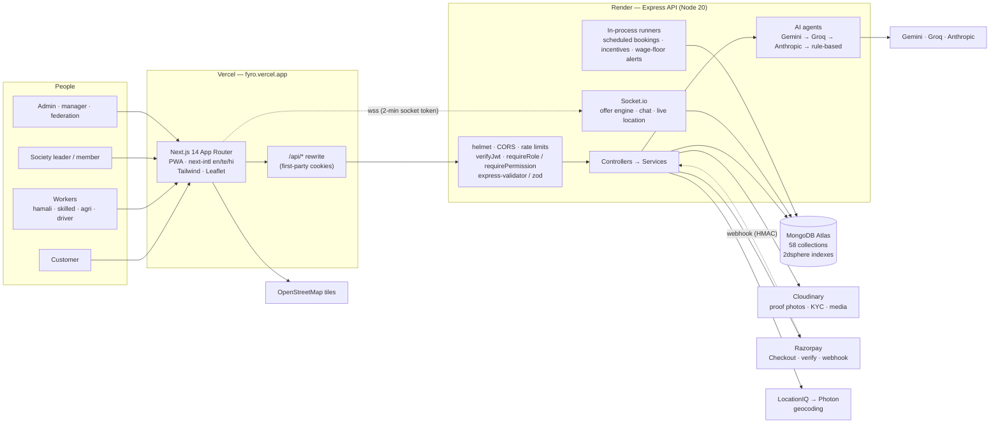

**Three workspaces** (npm workspaces): `shared` (types both sides agree on, built to `dist/`) → `server` → `client`.

---

## 2. Tech stack

| Layer | Technology | Why |
|---|---|---|
| **Frontend** | Next.js **14.2.5** App Router, React **18.3**, TypeScript **5.4.5** | One folder per role under `app/`; server components where possible |
| Styling | Tailwind CSS **3.4**, custom design-system primitives (`components/fy/`), Framer Motion 11 | Measured safe areas, no hard-coded chrome offsets |
| i18n | next-intl **4**, cookie locale (no URL segment) | English · తెలుగు · हिंदी at exact key parity (a test fails the build otherwise) |
| Maps | Leaflet 1.9 + react-leaflet 4, OpenStreetMap tiles | No map API key, works on low-end phones |
| Realtime | socket.io-client **4.8** | Offers, chat, live location, status pushes |
| PWA | Web manifest + service worker | Installable on Android; no native binary |
| **Backend** | Node 20, Express **4.19**, TypeScript | Plain, auditable request pipeline |
| Database | MongoDB Atlas via Mongoose **8** | 2dsphere geo queries, conditional atomic updates for races |
| Realtime | Socket.io **4.8** | Rooms per booking / user / role |
| Validation | express-validator + **zod** (`validateZod`) | Every body, param and query checked |
| Auth | JWT (jsonwebtoken 9) in httpOnly cookies, bcrypt 5 | Access 15 min · refresh 7 days · socket token 2 min |
| Security | helmet 7, express-rate-limit 7, CORS allow-list | Per-route limiters; Cloudflare-aware client IP |
| Documents | PDFKit 0.19 | GST tax invoice, bill of lading / load manifest, reports |
| Payments | Razorpay SDK 2.9 | Standard Checkout (UPI first), HMAC verify, webhook |
| Media | Cloudinary 2 | Proof photos, KYC documents, category imagery |
| AI | Google Gemini (`gemini-3.6-flash`), Groq (`llama-3.3-70b-versatile`), Anthropic (`claude-sonnet-5`) | Ordered provider chain with a rule-based floor |
| **Testing** | Jest 29 + supertest + mongodb-memory-server (server), Vitest 3 + Testing Library (client) | Real Mongo in memory — no mocked database |
| **Hosting** | Vercel (client), Render (API, `render.yaml`), MongoDB Atlas | Free tiers; Render sleeps when idle (first request wakes it) |

---

## 3. How a request travels

The browser only ever talks to `fyro.vercel.app`. Vercel rewrites `/api/*` to the Render API, so auth cookies are **first-party** — this is what keeps iOS Safari and installed PWAs signed in.

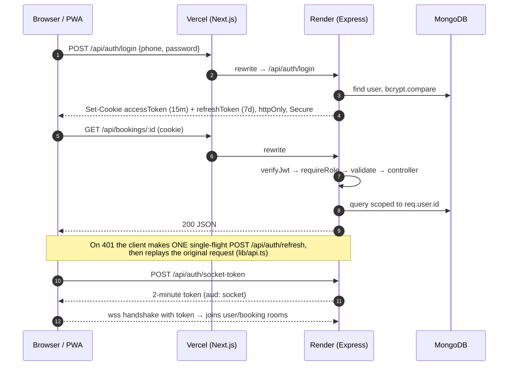

---

## 4. Booking lifecycle

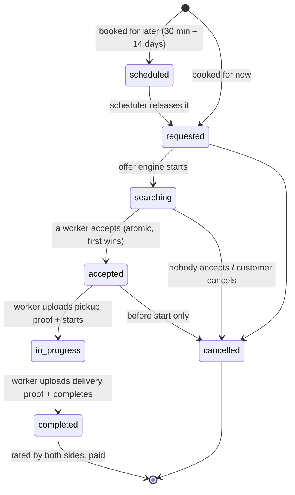

After `completed`:

- The customer pays (online or cash) — see [Payments](#6-payments).
- **Rating is mandatory on both sides**: a worker cannot accept the next job, nor a customer book again, while a completed job is unrated.
- The GST tax invoice is issued only against a **successful** payment.

---

## 5. Dispatch and the offer engine

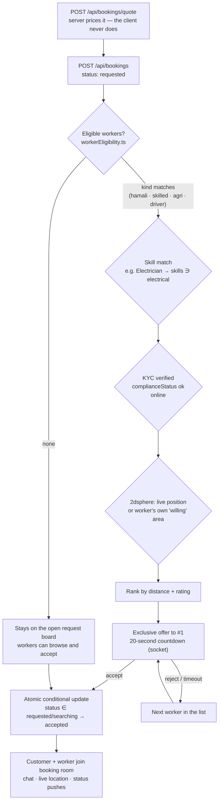

Both paths (pushed offer and browsing the board) converge on **one** atomic accept function — a booking can never be double-assigned.

---

## 6. Payments

Three modes, chosen by environment (`MOCK_PAYMENTS`, which falls back to `MOCK_EXTERNAL_SERVICES`):

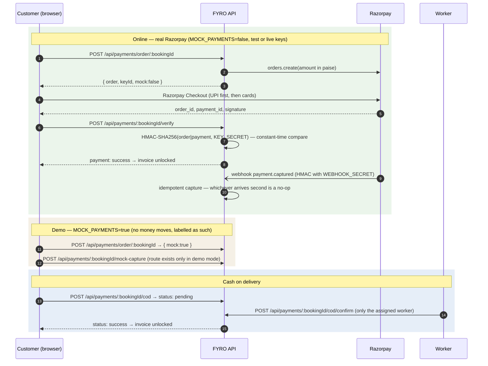

- The server **refuses to boot** in production with `MOCK_PAYMENTS=false` unless `RAZORPAY_KEY_ID`, `RAZORPAY_KEY_SECRET` and `RAZORPAY_WEBHOOK_SECRET` are all set — without the webhook secret anyone could post a fake "captured" event.
- Revenue is posted to the ledger exactly once per payment (conditional `findOneAndUpdate`).
- Admins reconcile cash at `/admin/cod-reconciliation` (JSON + CSV export).
- A customer can never mark their own cash payment as received — only the worker who took the cash can.

---

## 7. Where the money goes

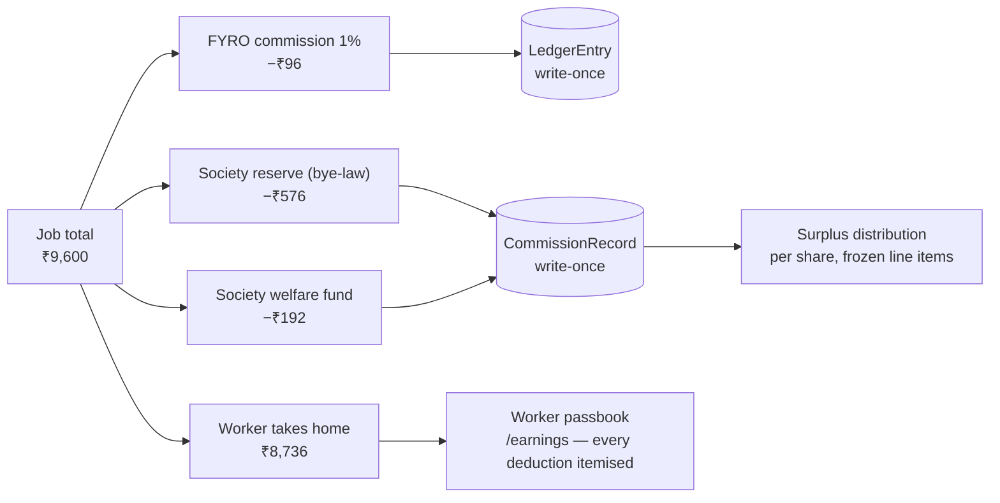

Deductions are taken on **gross** and never compounded, each on its own line. History is never recomputed: a job charged at an old rate keeps reading at that rate (production shows one worker's jobs reporting rates applied `[1, 10]`).

---

## 8. Pricing and the three floors

Every competing implementation prices labour hourly. A carpenter does not.

| Mode | Priced as | Typical trades |
|---|---|---|
| **Hourly** | `rate × max(hours, minimum block)` | Cleaning, house help, caregiving, gardening, loading |
| **Per unit** | `rate × max(quantity, minimum)` | Carpentry, wiring, painting |
| **Per task** | the published fixed price | Plumbing repairs, fan fitting, AC service |
| **Quotation** | the frozen accepted total, never recomputed | Rewires, bespoke carpentry, renovation |

Per-unit rates must use a controlled unit — `sq_ft_face`, `sq_ft_developed`, `per_point`, `per_running_ft`, `per_item` — because "₹300 per sq ft" of a wardrobe can mean the front face or every internal shelf (up to 40% apart). The declaration the customer read **freezes onto the booking** and prints on the invoice in their language.

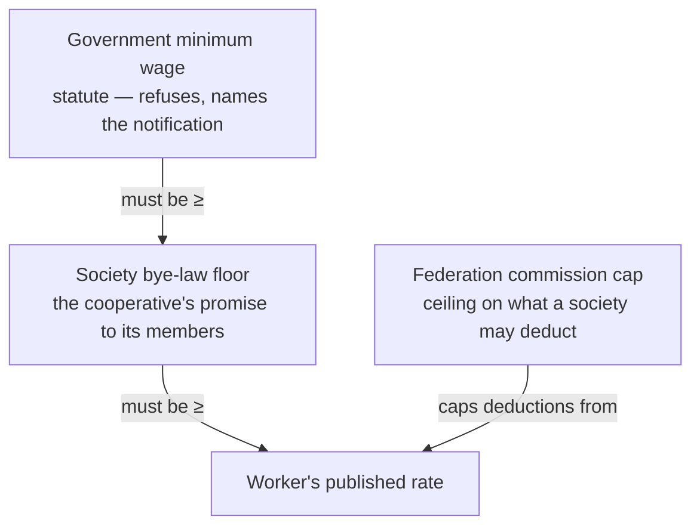

The statutory floor is derived from a monthly notified figure and the derivation is shown wherever the floor appears:

```
₹13,407 a month ÷ 26 working days ÷ 8 hours = ₹64.46 an hour   (AP Zone I, skilled)
```

Publishing below it returns `422` with that sentence — refused, never silently clamped.

> ⚠️ **On the rupee figures.** The seeded Andhra Pradesh figures (Notification G/3186486/2026) are transcribed from published secondary compilations, because the gazette PDF itself could not be retrieved. Every row is stamped `sourceType: 'secondary_compilation'`. Admins replace them at `/admin/wage-floors` (supersede, never overwrite).

---

## 9. KYC and verification

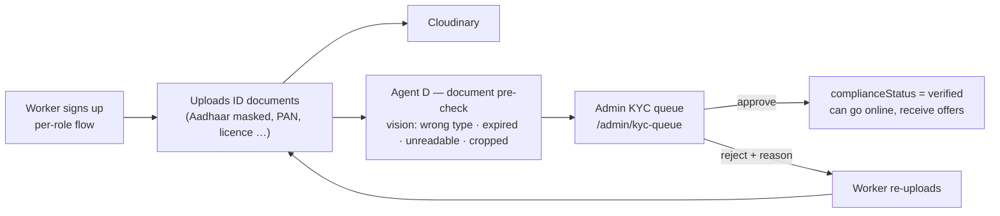

`complianceStatus` is enforced at **offer, bid and accept** — not just hidden in the UI.

---

## 10. AI utilisation

Six purpose-built agents in `server/src/agents/`, each answering one question a real person on the platform has. None of them is a general chatbot bolted to the UI, and **none can execute anything**.

| | Agent | Who uses it | Answers |
|---|---|---|---|
| **A** | **TARA** (support) | Everyone | Questions about *their own* bookings, complaints and policies — scoped server-side to `req.user.id`. Maps a described symptom to the right trade in all three languages; prices a job from rates real workers published in that region |
| **B** | **Dispute triage** | Admin / manager | Assembles the evidence packet — chat log, proof photos, status timestamps, fare breakdown — and recommends an outcome weighing both sides |
| **C** | **Demand forecasting** | Worker · admin · society leader | 14-day booking density → earnings hint, surge recommendation, workforce allocation hint |
| **D** | **Document pre-check** | Admin (KYC) | Real vision on the uploaded image before a human looks |
| **E** | **Pricing & quote** | Customer · admin | "Is this fare fair?" — grounded in the active `FareRule` *and* what bookings in this region actually settled for |
| **F** | **Market insights** | Admin | Week-over-week volume, revenue and utilisation narrative |

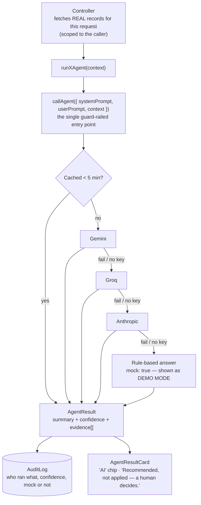

| Rule | How it is enforced |
|---|---|
| Never a bare verdict | `AgentResult` always carries `summary` + `confidence` + a non-empty `evidence` array |
| Never fabricated data | Agents receive already-fetched database records and are told to answer "not enough data" rather than invent a number |
| Never mistaken for a human | Every agent surface renders the same "AI" chip |
| Never acts on its own | Every card ends *"Recommended, not applied — a human decides."* |
| Never silently faked | No key → `mock: true`, computed from the same real context, labelled **DEMO MODE** |
| Never a data-access bypass | TARA and search only see what the caller's own role and id can see |

`AI_PROVIDER` = `auto` (default chain) · `gemini` · `groq` · `anthropic` · `mock`. The live provider is printed at boot and reported by `/api/health`.

---

## 11. Governance

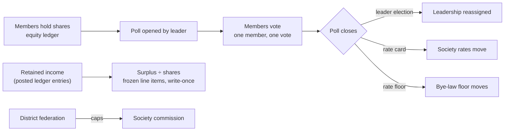

Polls **execute** when they close. Surplus distribution re-run for the same period returns `409`.

---

## 12. Security model

| Concern | Control |
|---|---|
| Sessions | httpOnly cookies (`Secure` + `SameSite=None` in production, `Strict` in development); access 15 min, refresh 7 days with single-flight silent refresh; socket token 2 min with `aud: 'socket'` |
| Passwords | bcrypt; never logged, never returned |
| Authorisation | `requireRole` / `requirePermission` on every router; every "my data" query scoped to `req.user.id` (IDOR-safe) |
| Input | express-validator / zod on every body, param and query |
| Abuse | Per-route rate limiters (auth, OTP, payments, requests, AI); signup fraud signals (rapid account creation per IP) |
| Money | Only through `ledger.service` (create-only entries); idempotent captures; HMAC-verified Razorpay callbacks with constant-time compare |
| Privileged actions | Written to `AuditLog` through `audit.service` |
| Headers | helmet on the API; HSTS |
| Secrets | Never committed — set in the Render / Vercel dashboards (`sync: false` in `render.yaml`) |
| Boot guards | Zod-validated env; production refuses to start with real payments but incomplete Razorpay config |

---

## 13. Accounts and credentials

These are **demo and test accounts on the public demo deployment**. They hold no real personal data. Do not reuse these passwords anywhere else.

### Demo accounts — one per role (password `Demo1234!`)

Created by `npm run seed:demo` (`server/src/scripts/seedDemoAccounts.ts`).

| Phone (username) | Role | Lands on |
|---|---|---|
| `9000000010` | Customer | `/customer/dashboard` |
| `9000000011` | Driver | `/driver/dashboard` |
| `9000000012` | Hamali (solo) — KYC verified, Vijayawada area, skill `electrical` | `/hamali/dashboard` |
| `9000000013` | Society (mutha) leader | `/mutha/dashboard` |
| `9000000014` | Society member | `/mutha-member/…` |
| `9000000015` | Fleet owner | `/fleet-owner/…` |
| `9000000016` | Warehouse hub | `/warehouse-hub/…` |
| `9000000017` | Manager | `/admin/…` (permission-scoped) |

### Test accounts (password `TestPass123!`)

`9200000001` – `9200000006`: throwaway accounts created while testing signup flows on production (`9200000001` is a solo hamali with KYC pending). Kept on purpose.

### Admin

The root admin is **not** a demo account. It is created from `ADMIN_PHONE` / `ADMIN_PASSWORD` (`npm run seed:admin`), so on a deployed instance only whoever set those variables can sign in as admin. Its credentials are never published.

### Test payment details (Razorpay test mode only)

When real Razorpay test keys are configured, use Razorpay's published test methods — UPI `success@razorpay`, or the test cards listed at [razorpay.com/docs/payments/payments/test-card-details](https://razorpay.com/docs/payments/payments/test-card-details/). No real money moves in test mode.

---

## 14. Environment variables

### API (`server/.env`, Render → Environment)

Validated by zod at boot (`server/src/config/env.ts`); the process refuses to start if a required one is missing.

| Variable | Required | Default | Purpose |
|---|---|---|---|
| `NODE_ENV` | | `development` | `production` on Render |
| `PORT` | | `4000` | |
| `CLIENT_ORIGIN` | ✅ | — | CORS allow-list origin, e.g. `https://fyro.vercel.app` |
| `MONGODB_URI` | ✅ | — | Atlas connection string |
| `JWT_ACCESS_SECRET` | ✅ | — | ≥ 32 chars (Render generates it) |
| `JWT_REFRESH_SECRET` | ✅ | — | ≥ 32 chars (Render generates it) |
| `ADMIN_PHONE` | ✅ | — | Root admin username |
| `ADMIN_PASSWORD` | ✅ | — | Root admin password (≥ 8 chars) |
| `MOCK_EXTERNAL_SERVICES` | | `true` | Master switch for every integration below |
| `MOCK_PAYMENTS` | | ↳ master | `true` = demo payments, `false` = real Razorpay |
| `MOCK_UPLOADS` | | ↳ master | `true` = fake Cloudinary URLs |
| `MOCK_OTP` | | ↳ master | `true` = no SMS sent |
| `RAZORPAY_KEY_ID` | when real payments | — | Public key id (sent to Checkout) |
| `RAZORPAY_KEY_SECRET` | when real payments | — | Verifies the Checkout signature |
| `RAZORPAY_WEBHOOK_SECRET` | when real payments | — | A secret **you choose** when adding the webhook in Razorpay |
| `CLOUDINARY_CLOUD_NAME` / `_API_KEY` / `_API_SECRET` | when real uploads | — | Media storage |
| `LOCATIONIQ_API_KEY` | | — | Geocoding; falls back to Photon |
| `GEMINI_API_KEY` · `GROQ_API_KEY` · `ANTHROPIC_API_KEY` | | — | AI providers; none = rule-based |
| `GEMINI_MODEL` | | built-in | Override when Google retires a model |
| `AI_PROVIDER` | | `auto` | `auto` · `gemini` · `groq` · `anthropic` · `mock` |
| `PARAMETRIC_PAYOUTS_ENABLED` | | `true` | Kill switch for automatic insurance payouts |
| `PLATFORM_GSTIN` | | — | Printed on invoices; absent prints "Not yet registered" (never invented) |
| `PLATFORM_LEGAL_NAME` | | `FYRO Logistics Platform` | Invoice header |

Razorpay webhook: `https://sih-2026-f63s.onrender.com/api/payments/webhook`, events `payment.captured`, `payment.failed`, `order.paid`.

### Client (Vercel → Environment)

| Variable | Purpose |
|---|---|
| `API_PROXY_TARGET` | Where the `/api/*` rewrite forwards to (`client/next.config.js`); defaults to the Render API |
| `NEXT_PUBLIC_API_BASE` | API base for the browser client (`lib/api.ts`); empty = same origin through the rewrite |
| `NEXT_PUBLIC_SOCKET_URL` | Socket origin (defaults to the API base) |

---

## 15. Run it locally

```bash
npm ci --include=dev          # installs all workspaces and builds shared/
```

Create `server/.env` with at least:

```bash
CLIENT_ORIGIN=http://localhost:3000
MONGODB_URI=mongodb://127.0.0.1:27017/fyro
JWT_ACCESS_SECRET=<32+ random characters>
JWT_REFRESH_SECRET=<32+ random characters>
ADMIN_PHONE=9999999999
ADMIN_PASSWORD=<8+ characters>
```

```bash
npm run dev:server            # API on :4000
npm run dev:client            # web on :3000 (second terminal)
```

### Seed (order matters)

```bash
cd server
npm run seed:admin            # root admin from ADMIN_PHONE / ADMIN_PASSWORD
npm run seed:federations      # 6 state + 43 district federations
npm run seed:categories       # the service categories (Electrician, Plumber, …)
npm run seed:fares            # 43 regions × vehicle / labour classes
npm run seed:demo             # the demo accounts above
npm run seed:training         # training curriculum (also self-seeds at boot)
npm run seed:checkpoints      # NH16 / NH65 toll plazas
npm run seed:insurance        # per-role insurance plans
npm run seed:wage-floors      # statutory floors (also self-seeds at boot)
```

### Test and build

```bash
npm run test:server           # Jest + supertest + mongodb-memory-server — 64 suites, 625 tests
npm test --workspace client   # Vitest + Testing Library (incl. en/te/hi parity test)
npm run build:server          # typecheck + build — what Render runs
npm run build:client          # typecheck + build — what Vercel runs
```

---

## 16. Repository layout

```
shared/                 types both sides agree on (built to dist/ — run `npm run build:shared` after edits)
server/src/
  agents/               six AI agents, provider chain (providers/), TARA (tara/), cache, types
  config/env.ts         zod-validated environment + boot guards
  controllers/          route handlers
  middleware/           auth, rbac, validation (express-validator + zod), rate limits
  models/               58 Mongoose schemas
  realtime/             socket auth, rooms, offer engine, emitters
  routes/               52 routers
  services/             pricing, fares, wage floors, matching, payments, ledger, governance,
                        geocoding, invoices (PDF), insurance, incentives, audit
  scripts/              seeders
server/tests/           64 Jest suites against an in-memory MongoDB
client/src/
  app/                  App Router — customer/, driver/, hamali/, skilled/, agri/, mutha/,
                        mutha-member/, fleet-owner/, warehouse-hub/, federation-state/,
                        federation-district/, admin/, emergency/, assistant/
  components/           shared UI (ui/), design-system primitives (fy/), per-domain folders
  i18n/                 en / te / hi catalogues + parity test
  lib/                  API client (single-flight refresh), auth context, Razorpay loader, hooks
render.yaml             Render blueprint for the API
```

---

## 17. Deployment

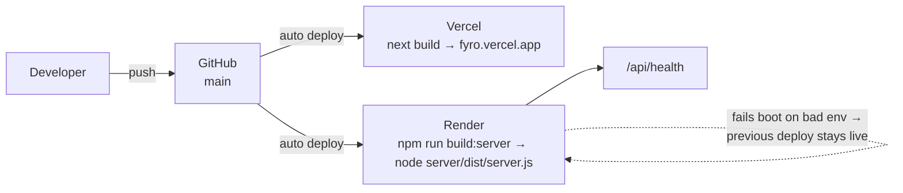

Secrets live only in the Vercel and Render dashboards. Render's free tier sleeps when idle; the first request after a pause takes a few seconds while it wakes.

---

## 18. The eleven required features

| # | Feature | Status |
|---|---|---|
| 01 | Provider registration & verification | **Built** — per-role signup, KYC upload, admin approve/reject, `complianceStatus` enforced at offer, bid and accept |
| 02 | Skill profiling & certification | **Built** — skills, capacity, sequential training academy, auto-issued certification |
| 03 | Booking & scheduling | **Built** — household trades, hamali crews, trucks; instant or scheduled 30 min – 14 days out; server-side pricing only |
| 04 | Geo-located matching | **Built** — 2dsphere against live position and a worker's own "willing" area; skill-aware; sequential offer engine |
| 05 | Digital payments & invoicing | **Built** — Razorpay Checkout + signature verify + webhook, demo mode, cash on delivery with worker confirmation, COD reconciliation, GST invoice PDF |
| 06 | Rating & feedback | **Built** — two-way and mandatory before the next job |
| 07 | Welfare & insurance | **Built** — per-role plans, consented enrolment, claims, parametric payouts with a kill switch and a daily cap |
| 08 | Emergency & on-demand booking | **Built** — press-and-hold SOS from any role into an ops queue, with 112 shown above it |
| 09 | Federation administration | **Built** — state rollup, district tier, society console; affiliation, suspension, bye-law ceilings |
| 10 | Multilingual application | **Built** — English / తెలుగు / हिंदी, 3,745 keys each at exact parity |
| 11 | AI demand forecasting & allocation | **Built** — six agents on real data, each with confidence and evidence, none able to act |

Beyond the brief: transit custody with NH16 / NH65 toll plazas as checkpoints, load manifests and e-way bill capture, an open load board with bidding, workmanship guarantee claims, fleet management, warehouse hubs with dock slots, referrals, incentive schemes, fraud signals, a full audit log, disputes separate from complaints, role-scoped global search, and an installable PWA.

---

## 19. Decisions worth knowing

- **Nothing is priced on the client.** The browser sends a quantity and a mode, never a price. Every fare comes from `POST /api/bookings/quote` or `POST /api/pricing/quote`.
- **Frozen, not recomputed.** Accepted quotations, unit declarations, commission records and platform fees are written once when agreed and read back afterwards.
- **Provider chains that degrade visibly.** Geocoding LocationIQ → Photon → visible failure; AI Gemini → Groq → Anthropic → rule-based. A fallback is always labelled.
- **Region is the pricing key, and it is correctable.** Derived from the pickup address, backfilled from coordinates, editable on every booking screen.
- **Locale is a cookie.** `/customer/dashboard` is the same URL in all three languages; every new string ships with real Telugu and Hindi in the same commit.
- **Safe areas are measured.** Fixed bars publish their own height as CSS variables; nothing hard-codes an offset.

---

## 20. Status, honestly

**Verified live on production (26 Sep 2026):** Electrician booking → skill-matched worker sees it → accepts → two-way chat within ~3 s → proof photos → start → complete → mandatory ratings → **Pay now succeeds** → GST invoice PDF downloads → worker passbook shows ₹594 net for two ₹300 jobs (1% commission itemised).

**Not built, or not live — named rather than glossed:**

- **Live money.** Razorpay Checkout, verify and webhook are built and tested, but production currently runs `MOCK_PAYMENTS=true` (demo payments). Switching to Razorpay test mode is configuration only.
- **OTP / SMS.** No SMS provider; real authentication is phone + password.
- **Password reset.** No SMS or email channel to send one through; the screen says so and names who can reset it.
- **Native app.** An installable PWA, not React Native — a deliberate scope call.
- **Trustee boards, charter PDFs, vehicle telemetry.** In the designs, not in the data model; left out rather than faked.
